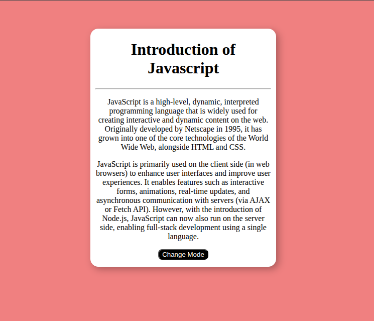
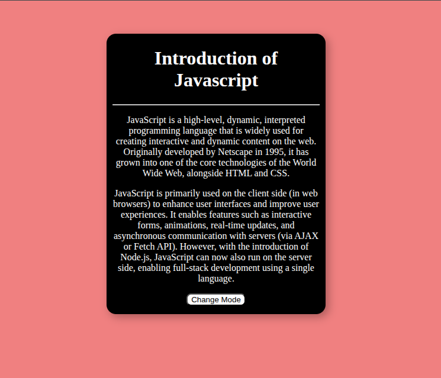

# 🌗 Changing mode with Javascript


A simple and responsive web project that demonstrates how to toggle between **light mode** and **dark mode** using plain **HTML**, **CSS**, and **JavaScript**. This is perfect for learning how to dynamically change themes in a web page.

## 🚀 Features

- Toggle between light and dark mode with a single button
- Smooth transitions between modes
- Responsive design
- Clean, beginner-friendly code
- Optional support for saving user preference using `localStorage`

## 📸 Demo


The above screenshot shows light mode.


The above screenshot shows dark mode.


## 🛠️ Tech Stack

- HTML5
- CSS3
- JavaScript (Vanilla)


## 🧠 How It Works

- The `body` element is given a class of either `light-mode` or `dark-mode`
- The toggle button calls JavaScript to switch these classes
- CSS handles the different background and text colors for each mode
- Optional: Use `localStorage` to remember the selected mode between sessions

## 📦 How to Use

1. **Clone the repository**
   ```bash
   git clone https://github.com/bijaypokhrel05/change-mode.git
   cd change-mode
   ```
2. **Open the project on browser**
```bash
    open index.html
```
or simply double-click `index.html` on your file explorer.


